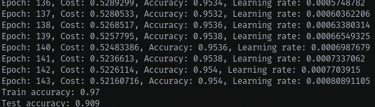

# AICourse

My take on Andrew Ng's great
[Machine Learning](https://www.youtube.com/watch?v=PPLop4L2eGk&list=PLLssT5z_DsK-h9vYZkQkYNWcItqhlRJLN&index=1)
couse.

This project contains ML solutions from scratch (no external algebra / ML
libraries required) in Rust.
The goal is to learn about how ML works on a deep level.

The solutions in this project serve as an example, and are probably not the
most correct or efficient solution to the problem. Perhaps it is more readable
than other implementations, given this is written by someone who has recently
started learning about machine learning.

## Package: aicourse

`aicourse` contains solutions for lectures 1-9 of the Machine Learning course.
This includes the modules:

- `matrix`: Matrix operations
- `regression`: Linear, logistic and polynomial regression
- `network`: Deep feed-forward (DFF) neural network

Gradient descent is used as the optimization algorithm. The learning rate is
automaticaly adjusted.

The DFF neural network uses the sigmoid activation function and can be trained
in parallel (regularization parallelism).
There is no proper splitting up of train / cross-validation / test datasets, so
the model optimization is not optimal.

## Package: aicourse-train

An executable that trains a DFF neural network to classify digits based on the
MNIST dataset.

To see a working neural network in action, clone the project including
submodules and run:  
`cargo run -p aicourse-train --release`

To see the available options, run:  
`cargo run -p aicourse-train --release -- --help`

After training a [28 * 28, 256, 10] unit network in parallel for
~70 epochs with the first 5000 samples of the MNIST train dataset, it is able
to classify the MNIST test dataset with an accuracy of ~92%. This takes
approximately 7 minutes with a Ryzen 5 1600 CPU.

## Package: aicourse-webcam

A program that reads a video feed from a webcam and classifies digits in
real-time. Uses a neural network configuration from `aicourse-train`.

Currently only Linux is supported. To run the program:  
`cargo run -p aicourse-webcam --release`
